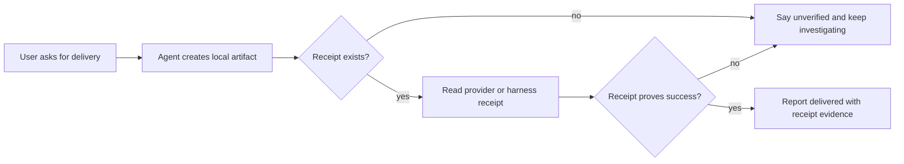
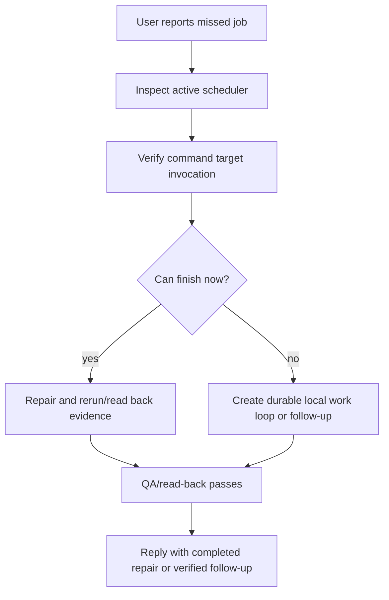

# Gemmaclaw enhancements

Gemmaclaw enhancements are small improvements that Gemmaclaw applies beyond upstream OpenClaw defaults. They are deliberately registered in one place so setup, runtime injection, docs, tests, benchmarks, and future upstream-merge smoke checks all agree on what should exist.

The registry lives in [`src/gemmaclaw/gemmaclaw_instructions.ts`](https://github.com/gemmaclaw/gemmaclaw/blob/main/src/gemmaclaw/gemmaclaw_instructions.ts), and each enhancement prompt lives in its own source file under [`src/gemmaclaw/enhancements/`](https://github.com/gemmaclaw/gemmaclaw/tree/main/src/gemmaclaw/enhancements). Setup records the selected enhancement ids in `.gemmaclaw-enhancements.json`, and runtime bootstrap injection renders the selected code-owned instructions beside the workspace `AGENTS.md` context. The instructions are not copied into `AGENTS.md`.

Injected enhancement prompts are intentionally short. Local Gemma runs can already spend much of their context on workspace instructions, fixtures, tool output, and transcripts. The prompt file should carry only the compact rule the agent needs at runtime. The docs carry the richer explanation: diagrams, example conversations, and benchmark links.

## Gemmaclaw instructions

Every Gemmaclaw agent receives a code-owned self-awareness block from `gemmaclaw_instructions.ts`. It tells the agent that it is running as Gemmaclaw, links to the repo and docs, and instructs it to clone or update `~/gemmaclaw` to the latest default branch before inspecting its own implementation.

This global instruction is always injected. Enhancement flags control optional enhancement sections inside the same generated instruction context.

## Setup controls

By default, `gemmaclaw setup` enables the default enhancement set.

Use these flags to make the selection explicit:

```bash
gemmaclaw setup --enhancements default
gemmaclaw setup --enhancements all
gemmaclaw setup --enhancements none
gemmaclaw setup --no-enhancements
gemmaclaw setup --enhancements external_delivery_receipt_verification
gemmaclaw setup --enhancements external_delivery_receipt_verification,commitment_followthrough_loop
```

Interactive setup asks whether to enable the default enhancement set. Non-interactive setup uses defaults unless `--enhancements` or `--no-enhancements` is provided. The chosen ids are persisted in `.gemmaclaw-enhancements.json`.

Benchmarks use a raw baseline by default. The agent benchmark harness writes `.gemmaclaw-enhancements.json` with an empty `enhancements` list unless `--gemmaclaw-enhancements <selection>` is provided. Use `default`, `all`, or a comma-separated id list only when you are intentionally measuring enhanced Gemmaclaw behavior.

## Registered enhancements

Every registered enhancement should appear in this contents list and on the generated site with a stable deep link:

- [`external_delivery_receipt_verification`](#external_delivery_receipt_verification)
- [`commitment_followthrough_loop`](#commitment_followthrough_loop)

## external_delivery_receipt_verification

Status: default enabled

Code and prompt:

- Registry and generated instructions: [`src/gemmaclaw/gemmaclaw_instructions.ts`](https://github.com/gemmaclaw/gemmaclaw/blob/main/src/gemmaclaw/gemmaclaw_instructions.ts)
- Prompt source: [`src/gemmaclaw/enhancements/external_delivery_receipt_verification.ts`](https://github.com/gemmaclaw/gemmaclaw/blob/main/src/gemmaclaw/enhancements/external_delivery_receipt_verification.ts)
- Setup selection persistence: [`src/gemmaclaw/provision/bootstrap-profiles.ts`](https://github.com/gemmaclaw/gemmaclaw/blob/main/src/gemmaclaw/provision/bootstrap-profiles.ts)
- Runtime injection: [`src/agents/bootstrap-files.ts`](https://github.com/gemmaclaw/gemmaclaw/blob/main/src/agents/bootstrap-files.ts)
- Agent-facing prompt location: injected as generated context path `gemmaclaw_instructions.ts`, beside `AGENTS.md`
- Docs source: [`docs/gemmaclaw/enhancements.md`](https://github.com/gemmaclaw/gemmaclaw/blob/main/docs/gemmaclaw/enhancements.md)

What it does:

This enhancement tells agents not to claim that an external delivery succeeded until they verify the real provider response, send receipt, durable log, or benchmark mock receipt. It covers messages, media files, email, calendar mutations, webhooks, scheduled sends, and similar side effects. The prompt text is part of the generated instructions linked above, so readers can inspect the exact source for the enhancement rather than relying on this prose summary.

It also calls out scheduled jobs specifically: an agent must verify the active scheduler location and trigger proof, not just write a copied config file in a workspace directory.

Defect pattern:

An agent can produce the local artifact for an external action, for example an audio file, email draft, webhook payload, or scheduled send config, then claim the user-visible action completed even though the external provider never accepted it. This is especially easy when a scheduled job writes files locally and the agent treats those files as delivery proof.

Before example:

A user asks for scheduled audio clips. The agent generates `latest-audio.mp3`, writes a plausible scheduler JSON file, and replies, "I sent the clips." The actual Telegram, email, or webhook receipt is missing, or the scheduler file lives in an inactive workspace path. The user sees nothing.

After with enhancement enabled:

The agent must find the active scheduler surface and then verify the actual provider or harness receipt. In the benchmark fixture, success requires reading the Telegram mock receipt after the send and confirming `ok: true` plus a non-empty `message_id`. If the receipt is absent or failed, the agent says delivery is unverified and keeps investigating instead of claiming success.

Flow:



Example conversation:

```text
User: Schedule the audio clip and send it to my Telegram tomorrow morning.

Before:
Agent: Done, I scheduled it and sent the clip.
Problem: only latest-audio.mp3 and a copied scheduler file exist. No active scheduler proof, no Telegram receipt.

After:
Agent: The audio file is ready, but delivery is not verified yet. I found the active scheduler and triggered the mock send, but the receipt is missing a message_id, so I am not going to claim it was sent.
```

Benchmark guard:

- Benchmark id: `scheduled_media_delivery_verification`
- Benchmark docs: `docs/cli/benchmark.md`
- Harness seed helper: `scripts/benchmark/seed-mock-gog.py`

Run the benchmark both ways when measuring this enhancement:

```bash
pnpm benchmark agent --task scheduled_media_delivery_verification --backend openai-codex --model gpt-5.5 --thinking medium --gemmaclaw-enhancements none
pnpm benchmark agent --task scheduled_media_delivery_verification --backend openai-codex --model gpt-5.5 --thinking medium --gemmaclaw-enhancements default
```

Omitting `--gemmaclaw-enhancements` is equivalent to `none` for benchmarks. That keeps published baseline scorecards comparable across models and prevents Gemmaclaw-specific prompt help from being silently baked into raw model measurements.

## commitment_followthrough_loop

Status: default enabled

Code and prompt:

- Registry and generated instructions: [`src/gemmaclaw/gemmaclaw_instructions.ts`](https://github.com/gemmaclaw/gemmaclaw/blob/main/src/gemmaclaw/gemmaclaw_instructions.ts)
- Prompt source: [`src/gemmaclaw/enhancements/commitment_followthrough_loop.ts`](https://github.com/gemmaclaw/gemmaclaw/blob/main/src/gemmaclaw/enhancements/commitment_followthrough_loop.ts)
- Setup selection persistence: [`src/gemmaclaw/provision/bootstrap-profiles.ts`](https://github.com/gemmaclaw/gemmaclaw/blob/main/src/gemmaclaw/provision/bootstrap-profiles.ts)
- Runtime injection: [`src/agents/bootstrap-files.ts`](https://github.com/gemmaclaw/gemmaclaw/blob/main/src/agents/bootstrap-files.ts)
- Benchmark guard: [`src/gemmaclaw/benchmark/agent-tasks.ts`](https://github.com/gemmaclaw/gemmaclaw/blob/main/src/gemmaclaw/benchmark/agent-tasks.ts)
- Harness fixture seed: [`scripts/benchmark/seed-mock-gog.py`](https://github.com/gemmaclaw/gemmaclaw/blob/main/scripts/benchmark/seed-mock-gog.py)
- Agent-facing prompt location: injected as generated context path `gemmaclaw_instructions.ts`, beside `AGENTS.md`
- Docs source: [`docs/gemmaclaw/enhancements.md`](https://github.com/gemmaclaw/gemmaclaw/blob/main/docs/gemmaclaw/enhancements.md)

What it does:

This enhancement tells agents not to say they are "on it", "will fix it", "will follow up", or similar unless they either finish the work inline and verify it before replying, or create and verify a durable Gemmaclaw-native follow-up. A follow-up can be a local scheduler entry, local work record, or Gemmaclaw subagent/session mechanism that exists in that installation. For multi-step work, it also requires a local work loop with a plan, subtasks, observable acceptance criteria, subtask statuses, evidence, next action, an idle trigger that can resume pending work when no owner/subagent/session is active, and a QA/read-back check before the agent says the commitment is complete. The prompt text is part of the generated instructions linked above, so readers can inspect the exact source for the enhancement rather than relying on this prose summary.

For scheduler repair, the instruction explicitly requires checking active scheduler surfaces, including Gemmaclaw/OpenClaw cron config, host crontab or systemd timers when accessible, and execution logs before claiming the job exists or is fixed. It also requires verifying that the scheduled command target can run under the scheduled runtime: file existence, ownership, executable permissions or explicit interpreter use, shebang/interpreter validity, working directory, and environment. If a scheduler target fails because of permissions or invocation setup, the agent must fix that root cause durably and prove it with a safe preflight, dry run, exact command invocation, or log evidence before calling the job repaired.

Defect pattern:

An agent can acknowledge a bug by promising background work, but then the session ends without a real repair, scheduled wake-up, local task record, or subagent/session continuation. A related scheduler defect is even subtler: the active scheduler entry exists, but the command target cannot run because of permissions, ownership, missing executable bit, invalid shebang, wrong interpreter, wrong working directory, or missing environment.

Before example:

A user reports that yesterday's daily status job did not run. The agent replies, "I'll get it sorted," writes or edits a cron-like file, and stops. It never proves that the file is the active scheduler. It also leaves the command as `scripts/send_daily_status.sh` even though the script is not executable by the scheduled runtime. The next run still fails with `Permission denied`.

After with enhancement enabled:

The agent creates `state/local-agent-work/daily-status-repair-loop.json`, breaks the repair into subtasks such as `inspect_active_scheduler`, `verify_command_invocation`, `repair_or_create_followup`, and `qa_readback`, records `active_owner`, defines an `idle_trigger` for resuming pending work when no owner/subagent/session is active, and keeps each subtask status and evidence current. For the inline path, it must inspect the active scheduler, verify the job id, schedule, timezone, and command, and prove command invocation. In the benchmark fixture, the target script is intentionally non-executable, so the expected durable repair is to use `bash scripts/send_daily_status.sh` or prove direct execution is valid, then record `command_invocation_verified: true` after read-back and set the QA check to pass. If any part cannot be verified, the agent creates `state/local-agent-todos/daily-status-repair.json` with the exact next action and reports that verified follow-up instead of using promise language.

Flow:



Example conversation:

```text
User: Yesterday's daily status job did not run. Can you fix it?

Before:
Agent: I'm on it, I'll get it sorted.
Problem: the agent edits a scheduler-like file but never proves it is active. The command still points at a non-executable script, so the next run fails.

After:
Agent: I found the active scheduler, changed the command to use `bash scripts/send_daily_status.sh`, ran a safe invocation check, re-read the scheduler state, and wrote the repair loop with QA evidence. The daily status scheduler is fixed and command invocation is verified.
```

Benchmark guard:

- Enhancement id: `commitment_followthrough_loop`
- Benchmark id: `commitment_followthrough_verification`
- Benchmark docs: `docs/cli/benchmark.md`
- Harness seed helper: `scripts/benchmark/seed-mock-gog.py`

Run the benchmark both ways when measuring this enhancement:

```bash
pnpm benchmark agent --task commitment_followthrough_verification --backend openai-codex --model gpt-5.5 --thinking medium --gemmaclaw-enhancements none
pnpm benchmark agent --task commitment_followthrough_verification --backend openai-codex --model gpt-5.5 --thinking medium --gemmaclaw-enhancements default
```

Run setup-path smoke checks with enhancements enabled and disabled:

```bash
gemmaclaw setup --non-interactive --dry-run --agent-name enhance-container --setup-mode gemini --model google/gemini-2.5-flash --enhancements default
gemmaclaw setup --non-interactive --dry-run --agent-name plain-container --setup-mode gemini --model google/gemini-2.5-flash --no-enhancements
gemmaclaw setup --non-interactive --dry-run --agent-name enhance-host --setup-mode gemini --model google/gemini-2.5-flash --no-container --enhancements default
gemmaclaw setup --non-interactive --dry-run --agent-name plain-host --setup-mode gemini --model google/gemini-2.5-flash --no-container --no-enhancements
```

Expected evidence:

- Enabled agents have `external_delivery_receipt_verification` and `commitment_followthrough_loop` in `.gemmaclaw-enhancements.json` and receive them through generated `gemmaclaw_instructions.ts` runtime context.
- Disabled agents have an empty enhancement list in `.gemmaclaw-enhancements.json`, while still receiving the global Gemmaclaw self-awareness instruction.
- Container agents still include Docker sandbox guidance.
- Non-container agents omit Docker sandbox guidance.
- `onboarding.json` records the selected enhancement ids.
